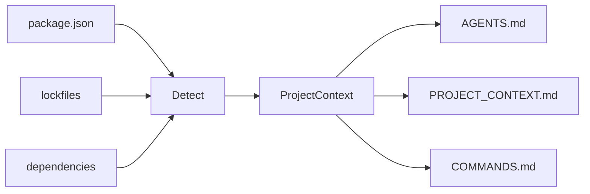

# agent-context-kit

<p align="right">
  <strong>English</strong> · <a href="./README.vi.md">Tiếng Việt</a>
</p>

> **Make any repository AI-agent-ready in 30 seconds.**

A small CLI that scans your Node.js project and generates context files for **Cursor**, **Codex**, **Claude Code**, **Copilot**, and other AI coding agents — so they stop guessing your stack, scripts, and folder layout.

---

## Quick start

```bash
npx agent-context-kit init
```

Preview first (recommended):

```bash
npx agent-context-kit init --dry-run
```

---

## Why this exists

AI agents work best when they already know:

| Without context | With `agent-context-kit` |
|-----------------|-------------------------|
| Guesses `npm` vs `pnpm` | Reads lockfile + `package.json` |
| Invents build/test commands | Uses real `package.json` scripts |
| Edits lockfiles by mistake | `AGENTS.md` lists files to avoid |
| Re-explains the repo every session | `PROJECT_CONTEXT.md` stays in the repo |

---

## What you get

After `init`, your project root can include:

| File | Purpose |
|------|---------|
| `AGENTS.md` | How agents should work in this repo (rules, folders, testing) |
| `PROJECT_CONTEXT.md` | Stack, package manager, dependencies, notes |
| `COMMANDS.md` | Dev, build, test, lint, and related scripts |

```text
my-app/
├── package.json
├── AGENTS.md              ← generated
├── PROJECT_CONTEXT.md     ← generated
└── COMMANDS.md            ← generated
```

---

## Install

**One-off (no install):**

```bash
npx agent-context-kit init
```

**pnpm:**

```bash
pnpm dlx agent-context-kit init
```

**Global:**

```bash
npm install -g agent-context-kit
agent-context-kit init
```

Requires **Node.js 18+**.

---

## Usage

### Generate context (current directory)

```bash
agent-context-kit init
```

### Scan another project

Use an **absolute path** (do not prefix with `cd`):

```bash
agent-context-kit init --cwd /Users/you/projects/my-app
```

### Preview without writing files

```bash
agent-context-kit init --dry-run
```

### Overwrite existing generated files

```bash
agent-context-kit init --force
```

### Combine flags

```bash
agent-context-kit init --cwd ./my-app --dry-run
agent-context-kit init --cwd ./my-app --force
```

### CLI options

| Flag | Description |
|------|-------------|
| `--dry-run` | Print detected info + full file preview; **does not write** to disk |
| `--force` | Overwrite `AGENTS.md`, `PROJECT_CONTEXT.md`, `COMMANDS.md` if they exist |
| `--cwd <path>` | Project directory to scan (default: current working directory) |

---

## Example terminal output

```text
agent-context-kit

Detected:
- Project: todoist-style-demo
- Package manager: npm
- Framework: React/Vite + Express
- Database: MongoDB/Mongoose
- Scripts: dev, dev:client, dev:server, build

Would generate:
- AGENTS.md
- PROJECT_CONTEXT.md
- COMMANDS.md

──────────────────────────────────────────────
Dry run — no files written.
```

When writing for real:

```text
Generated:
- PROJECT_CONTEXT.md
- COMMANDS.md
Skipped:
- AGENTS.md already exists. Use --force to overwrite.
```

With `--force`:

```text
Overwritten:
- AGENTS.md
Generated:
- PROJECT_CONTEXT.md
- COMMANDS.md
```

---

## What it detects (MVP)

Detection is **static** (from `package.json`, lockfiles, and root folders) — no AI API calls.

### Package manager

Priority: **lockfile** → `package.json` `packageManager` field → **npm** fallback

| Signal | Result |
|--------|--------|
| `pnpm-lock.yaml` | pnpm |
| `yarn.lock` | yarn |
| `bun.lock` / `bun.lockb` | bun |
| `package-lock.json` | npm |
| `"packageManager": "pnpm@9.0.0"` | pnpm (if no lockfile) |

### Stack (can combine layers)

| Layer | Examples |
|-------|----------|
| Frontend | Next.js, React/Vite, Vue/Vite, React |
| Backend | Express, NestJS, Fastify |
| Database | MongoDB/Mongoose, PostgreSQL, Prisma, Redis |

Full-stack example: **React/Vite + Express** with **MongoDB/Mongoose**.

### Scripts

Maps common scripts: `dev`, `build`, `test`, `lint`, `typecheck`, `format`.

Also surfaces related scripts such as `dev:client` and `dev:server` when referenced in your `dev` script.

### Important folders

Checks for: `src/`, `app/`, `pages/`, `components/`, `lib/`, `tests/` (at project root).

---

## Safety defaults

- **Never overwrites** existing `AGENTS.md`, `PROJECT_CONTEXT.md`, or `COMMANDS.md` unless you pass `--force`
- **`--dry-run`** never touches the filesystem
- Skips heavy directories (`node_modules`, `.git`, `dist`, …) when scanning
- Clear errors for missing/invalid `package.json` or bad `--cwd`

---

## How it works



More detail: [`doc/guide/SRC_WORKFLOW.md`](./doc/guide/SRC_WORKFLOW.md)

---

## Development

Clone and work on the CLI itself:

```bash
pnpm install
pnpm dev init --dry-run
pnpm dev init --cwd /path/to/your-project --dry-run
pnpm test
pnpm typecheck
pnpm build
pnpm start init --help
```

---

## Roadmap

- [ ] `agent-context-kit update` — refresh context after repo changes
- [ ] `agent-context-kit doctor` — validate context vs current project
- [ ] `.cursor/rules` and `CLAUDE.md` generators
- [ ] Python / FastAPI / Django support
- [ ] GitHub Action to keep context in sync
- [ ] Optional AI-enhanced summaries

---

## License

[MIT](./LICENSE)
