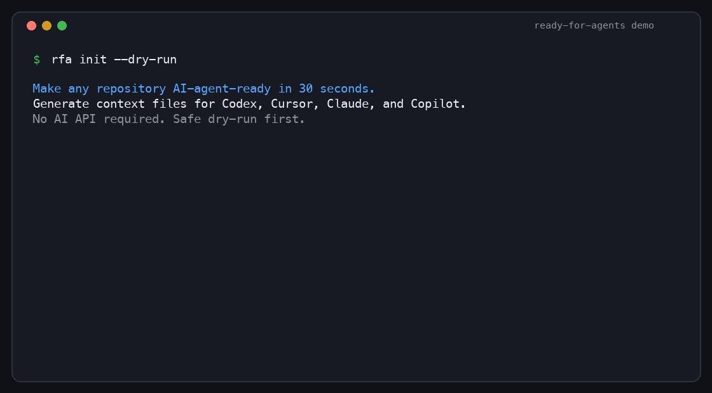
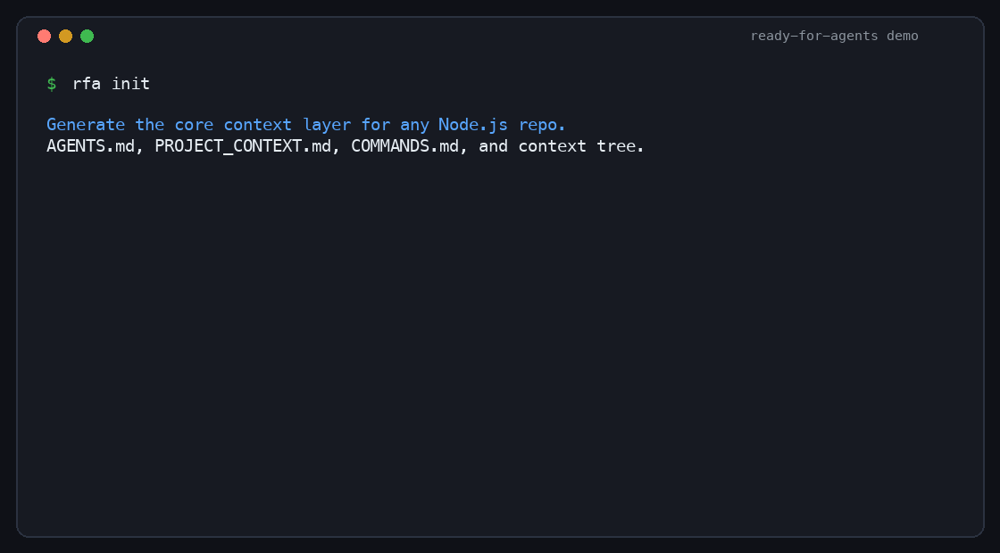
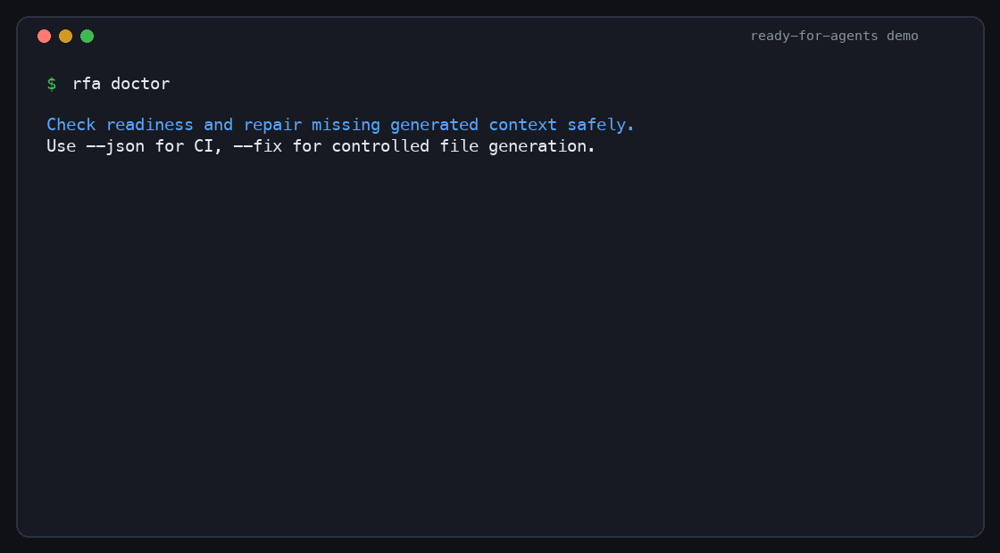
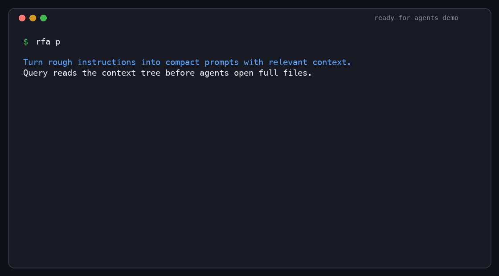
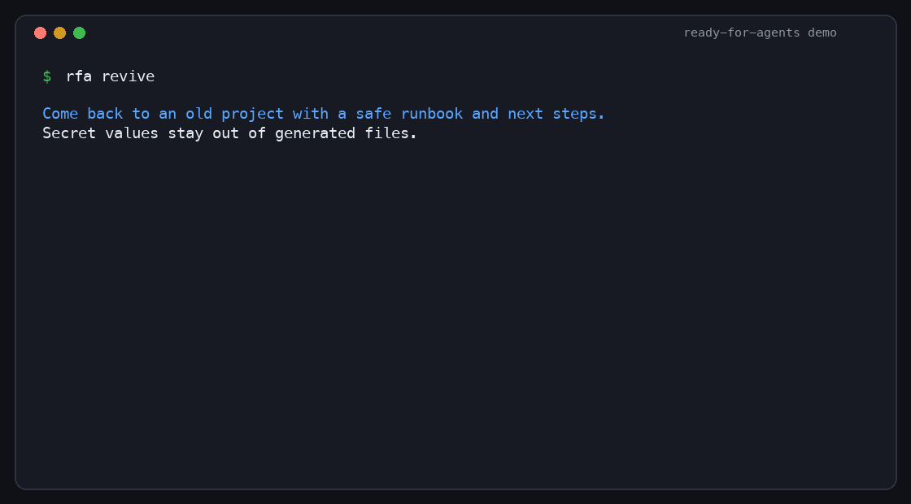
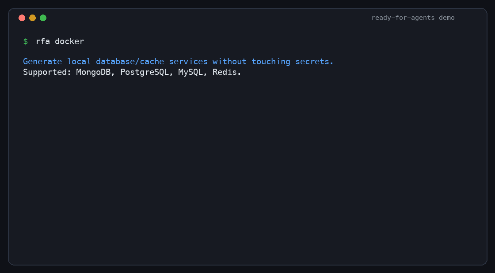
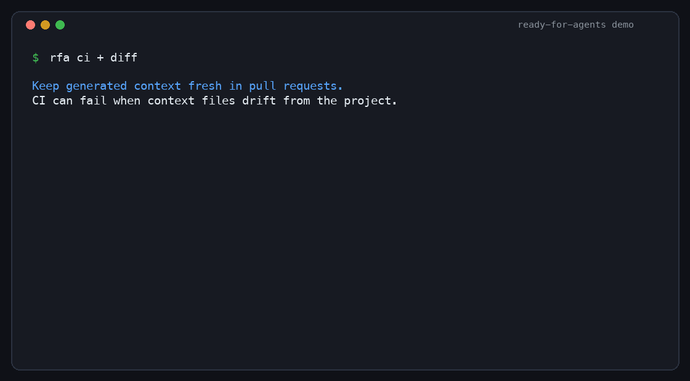
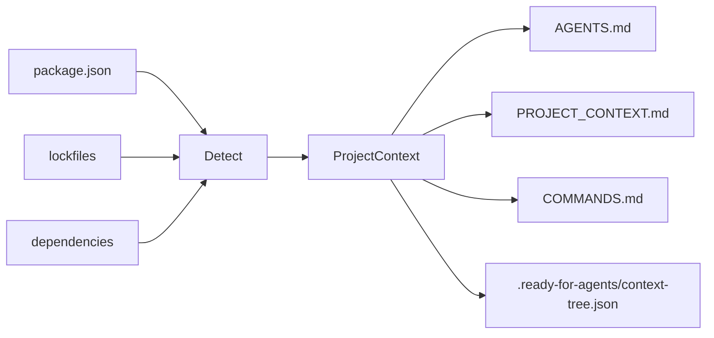
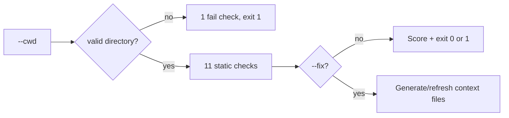

```
██████╗ ███████╗ █████╗ ██████╗ ██╗   ██╗    ███████╗ ██████╗ ██████╗
██╔══██╗██╔════╝██╔══██╗██╔══██╗╚██╗ ██╔╝    ██╔════╝██╔═══██╗██╔══██╗
██████╔╝█████╗  ███████║██║  ██║ ╚████╔╝     █████╗  ██║   ██║██████╔╝
██╔══██╗██╔══╝  ██╔══██║██║  ██║  ╚██╔╝      ██╔══╝  ██║   ██║██╔══██╗
██║  ██║███████╗██║  ██║██████╔╝   ██║       ██║     ╚██████╔╝██║  ██║
╚═╝  ╚═╝╚══════╝╚═╝  ╚═╝╚═════╝    ╚═╝       ╚═╝      ╚═════╝ ╚═╝  ╚═╝

 █████╗  ██████╗ ███████╗███╗   ██╗████████╗███████╗
██╔══██╗██╔════╝ ██╔════╝████╗  ██║╚══██╔══╝██╔════╝
███████║██║  ███╗█████╗  ██╔██╗ ██║   ██║   ███████╗
██╔══██║██║   ██║██╔══╝  ██║╚██╗██║   ██║   ╚════██║
██║  ██║╚██████╔╝███████╗██║ ╚████║   ██║   ███████║
╚═╝  ╚═╝ ╚═════╝ ╚══════╝╚═╝  ╚═══╝   ╚═╝   ╚══════╝

```

[](https://www.npmjs.com/package/ready-for-agents)
[](https://www.npmjs.com/package/ready-for-agents)
[](./LICENSE)
[](https://www.npmjs.com/package/ready-for-agents)
[](https://github.com/LeMinhSang2k5/ready-for-agents/actions/workflows/docs.yml)
[](https://github.com/LeMinhSang2k5/ready-for-agents/actions/workflows/publish.yml)

---

> **Make any repository AI-agent-ready in 30 seconds.**

A small CLI that scans your Node.js project and generates context files for **Cursor**, **Codex**, **Claude Code**, **Copilot**, and other AI coding agents — so they stop guessing your stack, scripts, and folder layout.

<p align="center">
  
</p>

---

## Quick start

```bash
npx --package ready-for-agents -- rfa init
```

Preview first (recommended):

```bash
npx --package ready-for-agents -- rfa init --dry-run
```

Generate native agent files for Cursor, Claude Code, and GitHub Copilot:

```bash
npx --package ready-for-agents -- rfa init --cursor
npx --package ready-for-agents -- rfa init --claude
npx --package ready-for-agents -- rfa init --copilot
npx --package ready-for-agents -- rfa init --all
```

Refresh generated context files after your project changes:

```bash
npx --package ready-for-agents -- rfa update
npx --package ready-for-agents -- rfa update --check
npx --package ready-for-agents -- rfa update --check --json
npx --package ready-for-agents -- rfa update --all
```

See how generated context differs from the current project:

```bash
npx --package ready-for-agents -- rfa diff
npx --package ready-for-agents -- rfa diff --json
npx --package ready-for-agents -- rfa diff --all
```

Generate a privacy-safe runbook for reviving an old project:

```bash
npx --package ready-for-agents -- rfa runbook --dry-run
npx --package ready-for-agents -- rfa runbook
```

`runbook` detects environment variable names from source code and safe templates such as `.env.example`, but it does not read or print values from `.env`, `.env.local`, or other non-template `.env*` files.

Generate local development services for detected databases:

```bash
npx --package ready-for-agents -- rfa docker --dry-run
npx --package ready-for-agents -- rfa docker
```

Prepare the full revival bundle in one pass:

```bash
npx --package ready-for-agents -- rfa revive --dry-run
npx --package ready-for-agents -- rfa revive
```

`revive` combines the privacy-safe runbook, supported local service compose file, and context tree cache. It prepares files and next steps; it does not run Docker, install dependencies, or read secret values.

Check whether a project is ready for AI agents (no file writes):

```bash
npx --package ready-for-agents -- rfa doctor
npx --package ready-for-agents -- rfa doctor --fix --dry-run
npx --package ready-for-agents -- rfa doctor --fix
npx --package ready-for-agents -- rfa doctor --cwd /path/to/your-project
```

Generate a GitHub Actions workflow for readiness and context freshness checks:

```bash
npx --package ready-for-agents -- rfa ci
npx --package ready-for-agents -- rfa ci --dry-run
```

Turn a rough instruction into a compact, agent-ready prompt (no AI API):

```bash
npx --package ready-for-agents -- rfa prompt "kiểm tra doctor --json giúp tôi"
npx --package ready-for-agents -- rfa prompt "kiểm tra doctor --json giúp tôi" --context --compact
npx --package ready-for-agents -- rfa prompt --target en "sửa lỗi doctor --json giúp tôi"
echo "review api. run pnpm test" | npx --package ready-for-agents -- rfa prompt --stdin --json
```

After global install, the short daily form is:

```bash
rfa p "kiểm tra doctor --json hoạt động đúng chưa"
```

Create a local config so you can type fewer flags:

```bash
npx --package ready-for-agents -- rfa config init
```

Build a compact context tree cache for generated agent files:

```bash
npx --package ready-for-agents -- rfa index
npx --package ready-for-agents -- rfa index --json
```

Ask the context tree which sections an agent should read first:

```bash
npx --package ready-for-agents -- rfa query "how should I verify this change?"
npx --package ready-for-agents -- rfa query "kiểm tra doctor hoạt động đúng chưa" --json
```

### Command map

Use the full command when teaching, documenting, or debugging. Use the alias when you are working daily.


| Full command      | Short form | Use it when you want to...                              | Writes files?                                   |
| ----------------- | ---------- | ------------------------------------------------------- | ----------------------------------------------- |
| `rfa init`        | `rfa i`    | create context files for a project                      | Yes, unless `--dry-run`                         |
| `rfa update`      | `rfa u`    | refresh generated context after the repo changes        | Yes, unless `--dry-run`, `--check`, or `--json` |
| `rfa doctor`      | `rfa d`    | check whether a project is AI-agent-ready               | Only with `--fix`                               |
| `rfa diff`        | —          | compare generated context with the current project      | No                                              |
| `rfa ci`          | —          | create a GitHub Actions workflow for agent checks       | Yes, unless `--dry-run`                         |
| `rfa runbook`     | `rfa r`    | create a privacy-safe project revival guide             | Yes, unless `--dry-run`                         |
| `rfa docker`      | —          | create local database/cache services for development    | Yes, unless `--dry-run`                         |
| `rfa revive`      | —          | prepare runbook, local services, and context index      | Yes, unless `--dry-run`                         |
| `rfa prompt`      | `rfa p`    | turn a rough instruction into a structured agent prompt | No                                              |
| `rfa config init` | `rfa c i`  | create `.ready-for-agents.json` defaults                | Yes, unless `--dry-run`                         |
| `rfa index`       | `rfa x`    | build `.ready-for-agents/context-tree.json`             | Yes, unless `--dry-run` or `--json`             |
| `rfa query`       | `rfa q`    | select relevant context sections for a task             | No                                              |


---

## Feature demos

Each demo is generated from [scripts/render-readme-demo.py](./scripts/render-readme-demo.py), so the visuals can be refreshed when CLI output changes.

| Context setup | Readiness checks |
| --- | --- |
|  |  |
| Generate `AGENTS.md`, `PROJECT_CONTEXT.md`, `COMMANDS.md`, and context tree metadata. | Check readiness, preview safe fixes, and use JSON output in CI. |

| Prompt + query | Runbook + revive |
| --- | --- |
|  |  |
| Compile rough instructions and select relevant context sections before full reads. | Create a privacy-safe project revival guide and next-step workflow. |

| Local services | CI + freshness |
| --- | --- |
|  |  |
| Generate local MongoDB/PostgreSQL/MySQL/Redis services without reading secrets. | Generate GitHub Actions checks and detect stale generated context. |

---

## Why this exists

AI agents work best when they already know:


| Without context                     | With `ready-for-agents`                 |
| ----------------------------------- | --------------------------------------- |
| Guesses `npm` vs `pnpm`             | Reads lockfile + `package.json`         |
| Invents build/test commands         | Uses real `package.json` scripts        |
| Edits lockfiles by mistake          | `AGENTS.md` lists files to avoid        |
| Re-explains the repo every session  | `PROJECT_CONTEXT.md` stays in the repo  |
| Reads every context file every turn | `query` selects relevant sections first |


---

## What you get

After using the relevant commands, your project root can include:


| File                                     | Purpose                                                       |
| ---------------------------------------- | ------------------------------------------------------------- |
| `AGENTS.md`                              | How agents should work in this repo (rules, folders, testing) |
| `PROJECT_CONTEXT.md`                     | Stack, package manager, dependencies, notes                   |
| `COMMANDS.md`                            | Dev, build, test, lint, and related scripts                   |
| `RUNBOOK.md`                             | Privacy-safe setup/revival guide (`runbook`)                  |
| `docker-compose.yml`                     | Local development services generated by `docker` / `revive`   |
| `.cursor/rules/ready-for-agents.mdc`     | Optional Cursor project rule (`init --cursor` or `--all`)     |
| `CLAUDE.md`                              | Optional Claude Code guidance (`init --claude` or `--all`)    |
| `.github/copilot-instructions.md`        | Optional GitHub Copilot repository instructions               |
| `.github/workflows/ready-for-agents.yml` | Optional GitHub Actions workflow (`ci`)                       |
| `.ready-for-agents/context-tree.json`    | Compact context tree cache for generated files                |
| `.ready-for-agents.json`                 | Optional project config (`config init`)                       |


```text
my-app/
├── package.json
├── AGENTS.md              ← generated
├── PROJECT_CONTEXT.md     ← generated
├── COMMANDS.md            ← generated
├── RUNBOOK.md             ← generated by rfa runbook
├── docker-compose.yml     ← generated by rfa docker/revive
└── .ready-for-agents/
    └── context-tree.json  ← generated cache
```

---

## Install

**One-off (no install):**

```bash
npx --package ready-for-agents -- rfa init
```

**pnpm:**

```bash
pnpm dlx --package ready-for-agents rfa init
```

**Global:**

```bash
npm install -g ready-for-agents
rfa init
```

Package name is `ready-for-agents`; the daily CLI binary is `rfa`. The legacy `ready-for-agents` binary is still published for compatibility.

Requires **Node.js 18+**.

---

## Usage

### Generate context (current directory)

```bash
rfa init
```

### Scan another project

Use an **absolute path** (do not prefix with `cd`):

```bash
rfa init --cwd /Users/you/projects/my-app
```

### Preview without writing files

```bash
rfa init --dry-run
```

### Overwrite existing generated files

```bash
rfa init --force
```

### Generate native agent files

```bash
rfa init --cursor
rfa init --claude
rfa init --copilot
rfa init --all
rfa init --index
```

By default, `init`, `update`, and `doctor --fix` also generate `.ready-for-agents/context-tree.json`. Disable it in `.ready-for-agents.json` with `"files": { "index": false }`, then re-enable per command with `--index`.

### Refresh generated context files

`update` regenerates selected context files. It refreshes files previously generated by `ready-for-agents`, creates missing selected files, and skips user-authored files unless you pass `--force`.

```bash
rfa update
rfa update --dry-run
rfa update --check
rfa update --check --json
rfa update --all
rfa update --index
rfa update --force
rfa update --cwd /Users/you/projects/my-app
```

### Compare generated context (`diff`)

`diff` compares the generated context files for the current project with what is already on disk. It does not write files.

```bash
rfa diff
rfa diff --json
rfa diff --all
rfa diff --cwd /Users/you/projects/my-app
```

Use `rfa update` to refresh tracked generated files after reviewing the diff.

### Generate GitHub Actions workflow (`ci`)

`ci` creates `.github/workflows/ready-for-agents.yml`, which checks readiness and generated context freshness on push and pull requests.

```bash
rfa ci
rfa ci --dry-run
rfa ci --force
rfa ci --cwd /Users/you/projects/my-app
```

### Generate a project runbook (`runbook`)

`runbook` creates `RUNBOOK.md` for returning to an old project: setup, environment variable names, scripts, runtime notes, and a revival checklist.

Privacy is the default: it does not read or print values from `.env`, `.env.local`, `.env.production`, or other non-template `.env*` files. Safe templates such as `.env.example` are used only for variable names.

```bash
rfa runbook --dry-run
rfa runbook
rfa r --cwd /Users/you/projects/my-app
rfa runbook --force
```

### Generate local development services (`docker`)

`docker` creates `docker-compose.yml` for local services that can be detected safely, such as MongoDB, PostgreSQL, MySQL, and Redis.

The generated compose file is for local development only. It does not read `.env` values and does not use production credentials.

```bash
rfa docker --dry-run
rfa docker
rfa docker --force
rfa docker --cwd /Users/you/projects/my-app
```

### Revive an old project (`revive`)

`revive` prepares the full local revival bundle:

- `RUNBOOK.md`
- `docker-compose.yml` when supported services are detected
- `.ready-for-agents/context-tree.json`
- copy-paste next steps for Docker, install, dev, and verification commands

It prepares files only. It does not run Docker, install dependencies, execute scripts, or read secret environment values.

```bash
rfa revive --dry-run
rfa revive
rfa revive --no-docker
rfa revive --no-index
rfa revive --force --cwd /Users/you/projects/my-app
```

### Combine flags

```bash
rfa init --cwd ./my-app --dry-run
rfa init --cwd ./my-app --force
```

### CLI options


| Flag           | Description                                                              |
| -------------- | ------------------------------------------------------------------------ |
| `--dry-run`    | Print detected info + full file preview; **does not write** to disk      |
| `--force`      | Overwrite `AGENTS.md`, `PROJECT_CONTEXT.md`, `COMMANDS.md` if they exist |
| `--cursor`     | Also generate `.cursor/rules/ready-for-agents.mdc`                       |
| `--claude`     | Also generate `CLAUDE.md`                                                |
| `--copilot`    | Also generate `.github/copilot-instructions.md`                          |
| `--all`        | Generate all optional agent files                                        |
| `--index`      | Generate `.ready-for-agents/context-tree.json`                           |
| `--cwd <path>` | Project directory to scan (default: current working directory)           |


### Update options


| Flag           | Description                                                              |
| -------------- | ------------------------------------------------------------------------ |
| `--dry-run`    | Preview refreshed content without writing files                          |
| `--check`      | Check whether selected generated files are current; does not write files |
| `--json`       | Print machine-readable check output; does not write files                |
| `--force`      | Overwrite untracked existing files instead of skipping them              |
| `--cursor`     | Also refresh `.cursor/rules/ready-for-agents.mdc`                        |
| `--claude`     | Also refresh `CLAUDE.md`                                                 |
| `--copilot`    | Also refresh `.github/copilot-instructions.md`                           |
| `--all`        | Refresh all optional agent files                                         |
| `--index`      | Regenerate `.ready-for-agents/context-tree.json`                         |
| `--cwd <path>` | Project directory to update (default: current working directory)         |


Generated files include a small content-hash marker. Markdown uses an HTML comment marker; YAML uses a `#` comment marker. `update` and `diff` use that marker to tell generated files apart from files you wrote by hand, and skip files whose marker hash no longer matches the file body.

### Validate or fix project readiness (`doctor`)

Runs static checks by default. With `--fix`, it creates missing context files, refreshes stale generated files, and skips user-authored files unless you pass `--force`.

```bash
rfa doctor
rfa doctor --fix --dry-run
rfa doctor --fix
rfa doctor --fix --json
rfa doctor --fix --index
rfa doctor --cwd /Users/you/projects/my-app
rfa doctor --json
```


| Flag           | Description                                                     |
| -------------- | --------------------------------------------------------------- |
| `--cwd <path>` | Project directory to check (default: current working directory) |
| `--json`       | Print machine-readable JSON for CI; no colored text output      |
| `--fix`        | Generate missing files and refresh stale generated files        |
| `--dry-run`    | With `--fix`, preview changes without writing files             |
| `--force`      | With `--fix`, overwrite untracked existing files                |
| `--cursor`     | With `--fix`, include `.cursor/rules/ready-for-agents.mdc`      |
| `--claude`     | With `--fix`, include `CLAUDE.md`                               |
| `--copilot`    | With `--fix`, include `.github/copilot-instructions.md`         |
| `--all`        | With `--fix`, include all optional agent files                  |
| `--index`      | With `--fix`, generate `.ready-for-agents/context-tree.json`    |


**Exit code:** `0` when there are no failures; `1` when any check has `fail` status (e.g. missing `package.json`).

If `--cwd` does not exist or is not a directory, `doctor` **stops after the first check** so you see the root cause instead of a long list of misleading warnings.

`doctor --fix` does not fix critical project problems such as missing or invalid `package.json`; resolve those first.

### Structure instructions (`prompt`)

Turn rough instructions into compact, structured prompts — **static only**, no translation model in MVP.

```bash
rfa prompt "kiểm tra doctor --json giúp tôi"
rfa prompt --target en "sửa lỗi doctor --json giúp tôi"
rfa prompt --target vi "Explain what prompt does"
rfa prompt "kiểm tra doctor --json" --context --compact
rfa p "kiểm tra doctor --json"
rfa prompt --stdin
rfa prompt --file task.txt
rfa prompt --cwd /Users/you/projects/my-app "Explain this task"
rfa prompt
```


| Flag                  | Description                                             |
| --------------------- | ------------------------------------------------------- |
| `[text]`              | Instruction (positional)                                |
| `--stdin`             | Read instruction from stdin                             |
| `--file <path>`       | Read instruction from file                              |
| `--target <auto\|en\|vi>` | Response language instruction                       |
| `--context`           | Include relevant context sections from context-tree     |
| `--no-context`        | Disable relevant context lookup                         |
| `--compact`           | Render a shorter prompt                                 |
| `--no-compact`        | Render the standard prompt style                        |
| `--context-limit <n>` | Maximum relevant context sections                       |
| `--json`              | Print JSON instead of Markdown                          |
| `--stats`             | Print size stats on stderr                              |
| `--cwd <path>`        | Project directory used to read `.ready-for-agents.json` |


**Exit code:** `0` on success; `1` when input is empty after normalization.

`--target` is rule-based. It controls the generated response instruction; it does not call a translation model.

If `--target` is omitted, `prompt` uses `prompt.target` from `.ready-for-agents.json`, then falls back to `auto`.

`p` is a short alias for `prompt` with `--context --compact` defaults. Use `--no-context` or `--no-compact` to opt out.

Spec: `[doc/guide/PROMPT_SPEC.md](./doc/guide/PROMPT_SPEC.md)`.

### Configure defaults

Use config when you repeatedly want the same optional files, prompt target, or context tree output path:

```bash
rfa config init
rfa config init --dry-run
rfa config init --force
```

Default config:

```json
{
  "$schema": "https://ready-for-agents.dev/config.schema.json",
  "files": {
    "cursor": false,
    "claude": false,
    "copilot": false,
    "all": false,
    "index": true
  },
  "doctor": {
    "fix": {
      "all": false,
      "force": false,
      "index": true
    }
  },
  "prompt": {
    "target": "auto",
    "context": false,
    "style": "standard",
    "contextLimit": 5
  },
  "index": {
    "output": ".ready-for-agents/context-tree.json"
  }
}
```

The current config filename is `.ready-for-agents.json`. The old `.agent-context-kit.json` name is still read for compatibility.

### Build the context tree (`index`)

`index` reads generated files and writes a compact tree of headings, anchors, hashes, keywords, commands, summaries, and estimated tokens. Agents or CI can read this cache first instead of repeatedly scanning every Markdown file.

```bash
rfa index
rfa index --dry-run
rfa index --json
rfa index --output .cache/agent-context-tree.json
rfa index --cwd /Users/you/projects/my-app
```

Output path defaults to `.ready-for-agents/context-tree.json` and can be changed in config.

### Query relevant context (`query`)

`query` uses `.ready-for-agents/context-tree.json` when present, or scans existing generated context files live. It returns section references, line ranges, short summaries, reasons, and estimated tokens so an agent can read only the most relevant context first.

```bash
rfa query "how should I verify this change?"
rfa query "kiểm tra doctor hoạt động đúng chưa" --limit 4
rfa query "show stack and dependencies" --json
rfa query "fix build" --cwd /Users/you/projects/my-app
```

Recommended flow:

```bash
rfa init --index
rfa query "describe your task"
```

For CI, use JSON output:

```bash
rfa doctor --json
```

```json
{
  "cwd": "/path/to/project",
  "ok": true,
  "score": {
    "passed": 11,
    "warned": 0,
    "failed": 0,
    "total": 11
  },
  "checks": [
    {
      "label": "Project directory found",
      "status": "pass"
    }
  ]
}
```

**Checks (when the directory is valid):**


| Check                                            | `pass`                             | `warn`            | `fail`                     |
| ------------------------------------------------ | ---------------------------------- | ----------------- | -------------------------- |
| Project directory                                | exists and is a directory          | —                 | missing or not a directory |
| `package.json`                                   | found                              | —                 | missing                    |
| `package.json` JSON                              | valid                              | —                 | invalid / unreadable       |
| Package manager                                  | lockfile or `packageManager` field | npm fallback only | —                          |
| `AGENTS.md`, `PROJECT_CONTEXT.md`, `COMMANDS.md` | found                              | missing           | —                          |
| `dev`, `build`, `test` scripts                   | found                              | missing           | —                          |
| `README.md`                                      | found                              | missing           | —                          |


---

## Example terminal output

```text
ready-for-agents

Detected:
- Project: todoist-style-demo
- Package manager: npm
- Framework: React/Vite + Express
- Database: MongoDB/Mongoose
- Scripts: dev, dev:client, dev:server, build

Would generate:
- AGENTS.md
- PROJECT_CONTEXT.md
- COMMANDS.md
- .ready-for-agents/context-tree.json

──────────────────────────────────────────────
Dry run — no files written.
```

When writing for real:

```text
Generated:
- PROJECT_CONTEXT.md
- COMMANDS.md
Skipped:
- AGENTS.md already exists. Use --force to overwrite.
```

With `--force`:

```text
Overwritten:
- AGENTS.md
Generated:
- PROJECT_CONTEXT.md
- COMMANDS.md
```

`doctor` (wrong `--cwd` — early exit):

```text
rfa doctor

Checks:
  ✗ Project directory found (/wrong/path does not exist)

Score: 0/1 · 0 warnings · 1 failure
```

`doctor` (valid project, some context files missing):

```text
rfa doctor

Checks:
  ✓ Project directory found
  ✓ package.json found
  ✓ package.json is valid JSON
  ✓ Package manager detected: npm
  ! AGENTS.md found
  ! PROJECT_CONTEXT.md found
  ! COMMANDS.md found
  ✓ dev script found
  ✓ build script found
  ! test script not found
  ✓ README.md found

Score: 6/11 · 4 warnings · 0 failures
```

---

## What it detects (MVP)

Detection is **static** (from `package.json`, lockfiles, and root folders) — no AI API calls.

### Package manager

Priority: **lockfile** → `package.json` `packageManager` field → **npm** fallback


| Signal                           | Result                |
| -------------------------------- | --------------------- |
| `pnpm-lock.yaml`                 | pnpm                  |
| `yarn.lock`                      | yarn                  |
| `bun.lock` / `bun.lockb`         | bun                   |
| `package-lock.json`              | npm                   |
| `"packageManager": "pnpm@9.0.0"` | pnpm (if no lockfile) |


### Stack (can combine layers)

Each layer picks the **first matching rule** from `dependencies` + `devDependencies`. Multiple layers can appear together (e.g. frontend + backend + database).


| Layer    | Detected labels (in rule order)                                              |
| -------- | ---------------------------------------------------------------------------- |
| Frontend | Next.js, Nuxt, React/Vite, Vue/Vite, React (CRA), React, Vue, Svelte         |
| Backend  | NestJS, Express, Fastify, Koa, Hono                                          |
| Database | MongoDB/Mongoose, MongoDB, Prisma, TypeORM, PostgreSQL, MySQL, SQLite, Redis |


If nothing matches, framework summary falls back to **Node.js**.

Full-stack example: **React/Vite + Express** with **MongoDB/Mongoose**.

### Scripts

Maps these logical script keys (first matching alias in `package.json` wins):


| Key         | Aliases also checked                     |
| ----------- | ---------------------------------------- |
| `dev`       | `start:dev`, `develop`                   |
| `build`     | `build`                                  |
| `test`      | `test`, `test:unit`, `test:run`          |
| `lint`      | `lint`, `eslint`                         |
| `typecheck` | `typecheck`, `type-check`, `check:types` |
| `format`    | `format`, `prettier`, `fmt`              |


Also lists related scripts (e.g. `dev:client`, `dev:server`) when they exist as `dev:`* or are referenced inside the `dev` command.

### Important folders

Checks for: `src/`, `app/`, `pages/`, `components/`, `lib/`, `tests/` (at project root).

---

## Safety defaults

- **Never overwrites** existing `AGENTS.md`, `PROJECT_CONTEXT.md`, or `COMMANDS.md` unless you pass `--force`
- `**--dry-run`** never touches the filesystem
- Skips heavy directories (`node_modules`, `.git`, `dist`, …) when scanning
- Skips the generated context cache directory (`.ready-for-agents/`) when scanning
- Clear errors for missing/invalid `package.json` or bad `--cwd` (`init` and `doctor`)
- `doctor` fails fast when `--cwd` is wrong (no spurious “missing context file” noise)

---

## How it works

`**init**` — detect → generate Markdown:




`**doctor**` — validate; `--fix` can safely repair context files:




**Full specs:** `[doc/guide/README.md](./doc/guide/README.md)` (requirements, CLI, data model, detection rules, architecture).  
Implementation walkthrough: `[doc/guide/SRC_WORKFLOW.md](./doc/guide/SRC_WORKFLOW.md)`.

---

## Development

Clone and work on the CLI itself:

```bash
pnpm install
pnpm dev init --dry-run
pnpm dev init --cwd /path/to/your-project --dry-run
pnpm dev doctor --cwd /path/to/your-project
pnpm dev doctor --fix --dry-run --cwd /path/to/your-project
pnpm dev diff --cwd /path/to/your-project
pnpm dev ci --dry-run --cwd /path/to/your-project
pnpm dev runbook --dry-run --cwd /path/to/your-project
pnpm dev docker --dry-run --cwd /path/to/your-project
pnpm dev revive --dry-run --cwd /path/to/your-project
pnpm dev config init --dry-run --cwd /path/to/your-project
pnpm dev index --dry-run --cwd /path/to/your-project
pnpm dev query "how should I verify this change?" --cwd /path/to/your-project
pnpm test
pnpm typecheck
pnpm build
pnpm start init --help
pnpm start doctor --cwd /path/to/your-project
pnpm start index --cwd /path/to/your-project
pnpm start query "show stack and dependencies" --cwd /path/to/your-project
pnpm --silent start doctor --json --cwd /path/to/your-project
```

Release: [CHANGELOG.md](./CHANGELOG.md) · Publish: [PUBLISH_CHECKLIST.md](./PUBLISH_CHECKLIST.md)

### Documentation site

The research-style docs site is generated from `doc/guide` into `site/`.

```bash
pnpm docs:build
pnpm docs:preview
```

GitHub Pages deploys through `.github/workflows/docs.yml`. In the repository settings, set Pages source to **GitHub Actions**.

Regenerate the README demo GIFs:

```bash
python3 scripts/render-readme-demo.py
```

---

## Roadmap

- `rfa doctor` — validate project readiness (static checks, no writes)
- `doctor --fix` — safely generate/refresh context files
- `doctor --json` — machine-readable output for CI
- `rfa prompt` — structure rough instructions, --file, and interactive mode (no AI API)
- `prompt --target auto|en|vi` — choose response language instruction
- `.cursor/rules`, `CLAUDE.md`, and `.github/copilot-instructions.md` optional generators
- `rfa update` — refresh generated context files after repo changes
- `rfa diff` — compare generated context with the current project
- `rfa ci` — generate GitHub Actions checks for readiness and context freshness
- `rfa runbook` — generate a privacy-safe revival guide for old projects
- `rfa docker` — generate local development services for detected databases/caches
- `rfa revive` — prepare runbook, local services, and context index together
- `.ready-for-agents.json` — project defaults for optional files, prompt target, and index output
- `rfa index` — compact context tree cache for generated agent files
- `rfa query` — select relevant context sections before full reads
- `prompt --style`
- `prompt --ai` opt-in rewrite
- Python / FastAPI / Django support
- Optional AI-enhanced summaries

---

## License

[MIT](./LICENSE)
