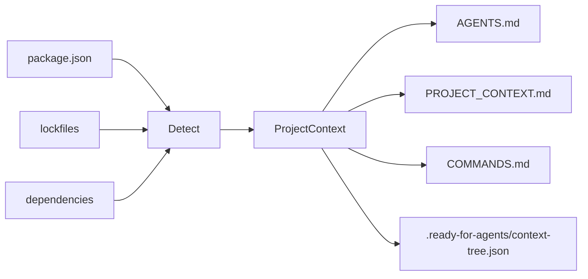
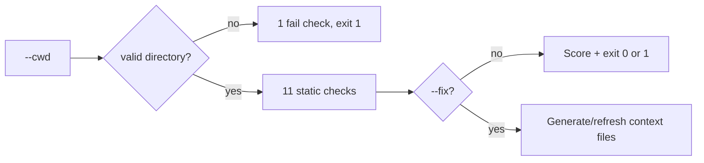

# ready-for-agents

<p align="right">
  <strong>English</strong> · <a href="./README.vi.md">Tiếng Việt</a>
</p>

> **Make any repository AI-agent-ready in 30 seconds.**

A small CLI that scans your Node.js project and generates context files for **Cursor**, **Codex**, **Claude Code**, **Copilot**, and other AI coding agents — so they stop guessing your stack, scripts, and folder layout.

[GitHub repository](https://github.com/LeMinhSang2k5/ready-for-agents) · [npm package](https://www.npmjs.com/package/ready-for-agents)

---

## Quick start

```bash
npx ready-for-agents init
```

Preview first (recommended):

```bash
npx ready-for-agents init --dry-run
```

Generate native agent files for Cursor and Claude Code:

```bash
npx ready-for-agents init --cursor
npx ready-for-agents init --claude
npx ready-for-agents init --all
```

Refresh generated context files after your project changes:

```bash
npx ready-for-agents update
npx ready-for-agents update --check
npx ready-for-agents update --check --json
npx ready-for-agents update --all
```

Check whether a project is ready for AI agents (no file writes):

```bash
npx ready-for-agents doctor
npx ready-for-agents doctor --fix --dry-run
npx ready-for-agents doctor --fix
npx ready-for-agents doctor --cwd /path/to/your-project
```

Turn a rough instruction into a compact, agent-ready prompt (no AI API):

```bash
npx ready-for-agents prompt "kiểm tra doctor --json giúp tôi"
npx ready-for-agents prompt "kiểm tra doctor --json giúp tôi" --context --compact
npx ready-for-agents prompt --target en "sửa lỗi doctor --json giúp tôi"
echo "review api. run pnpm test" | npx ready-for-agents prompt --stdin --json
```

After global install, the short daily form is:

```bash
rfa p "kiểm tra doctor --json hoạt động đúng chưa"
```

Create a local config so you can type fewer flags:

```bash
npx ready-for-agents config init
```

Build a compact context tree cache for generated agent files:

```bash
npx ready-for-agents index
npx ready-for-agents index --json
```

Ask the context tree which sections an agent should read first:

```bash
npx ready-for-agents query "how should I verify this change?"
npx ready-for-agents query "kiểm tra doctor hoạt động đúng chưa" --json
```

### Command map

| Command       | Use it when you want to...                              | Writes files?                                   |
| ------------- | ------------------------------------------------------- | ----------------------------------------------- |
| `init`        | create context files for a project                      | Yes, unless `--dry-run`                         |
| `update`      | refresh generated context after the repo changes        | Yes, unless `--dry-run`, `--check`, or `--json` |
| `doctor`      | check whether a project is AI-agent-ready               | Only with `--fix`                               |
| `prompt`      | turn a rough instruction into a structured agent prompt | No                                              |
| `config init` | create `.ready-for-agents.json` defaults                | Yes, unless `--dry-run`                         |
| `index`       | build `.ready-for-agents/context-tree.json`             | Yes, unless `--dry-run` or `--json`             |
| `query`       | select relevant context sections for a task             | No                                              |

---

## Why this exists

AI agents work best when they already know:

| Without context                     | With `ready-for-agents`                 |
| ----------------------------------- | --------------------------------------- |
| Guesses `npm` vs `pnpm`             | Reads lockfile + `package.json`         |
| Invents build/test commands         | Uses real `package.json` scripts        |
| Edits lockfiles by mistake          | `AGENTS.md` lists files to avoid        |
| Re-explains the repo every session  | `PROJECT_CONTEXT.md` stays in the repo  |
| Reads every context file every turn | `query` selects relevant sections first |

---

## What you get

After `init`, your project root can include:

| File                                  | Purpose                                                       |
| ------------------------------------- | ------------------------------------------------------------- |
| `AGENTS.md`                           | How agents should work in this repo (rules, folders, testing) |
| `PROJECT_CONTEXT.md`                  | Stack, package manager, dependencies, notes                   |
| `COMMANDS.md`                         | Dev, build, test, lint, and related scripts                   |
| `.cursor/rules/ready-for-agents.mdc`  | Optional Cursor project rule (`init --cursor` or `--all`)     |
| `CLAUDE.md`                           | Optional Claude Code guidance (`init --claude` or `--all`)    |
| `.ready-for-agents/context-tree.json` | Compact context tree cache for generated files                |
| `.ready-for-agents.json`              | Optional project config (`config init`)                       |

```text
my-app/
├── package.json
├── AGENTS.md              ← generated
├── PROJECT_CONTEXT.md     ← generated
├── COMMANDS.md            ← generated
└── .ready-for-agents/
    └── context-tree.json  ← generated cache
```

---

## Install

**One-off (no install):**

```bash
npx ready-for-agents init
```

**pnpm:**

```bash
pnpm dlx ready-for-agents init
```

**Global:**

```bash
npm install -g ready-for-agents
ready-for-agents init
```

Requires **Node.js 18+**.

---

## Usage

### Generate context (current directory)

```bash
ready-for-agents init
```

### Scan another project

Use an **absolute path** (do not prefix with `cd`):

```bash
ready-for-agents init --cwd /Users/you/projects/my-app
```

### Preview without writing files

```bash
ready-for-agents init --dry-run
```

### Overwrite existing generated files

```bash
ready-for-agents init --force
```

### Generate native agent files

```bash
ready-for-agents init --cursor
ready-for-agents init --claude
ready-for-agents init --all
ready-for-agents init --index
```

By default, `init`, `update`, and `doctor --fix` also generate `.ready-for-agents/context-tree.json`. Disable it in `.ready-for-agents.json` with `"files": { "index": false }`, then re-enable per command with `--index`.

### Refresh generated context files

`update` regenerates selected context files. It refreshes files previously generated by `ready-for-agents`, creates missing selected files, and skips user-authored files unless you pass `--force`.

```bash
ready-for-agents update
ready-for-agents update --dry-run
ready-for-agents update --check
ready-for-agents update --check --json
ready-for-agents update --all
ready-for-agents update --index
ready-for-agents update --force
ready-for-agents update --cwd /Users/you/projects/my-app
```

### Combine flags

```bash
ready-for-agents init --cwd ./my-app --dry-run
ready-for-agents init --cwd ./my-app --force
```

### CLI options

| Flag           | Description                                                              |
| -------------- | ------------------------------------------------------------------------ |
| `--dry-run`    | Print detected info + full file preview; **does not write** to disk      |
| `--force`      | Overwrite `AGENTS.md`, `PROJECT_CONTEXT.md`, `COMMANDS.md` if they exist |
| `--cursor`     | Also generate `.cursor/rules/ready-for-agents.mdc`                       |
| `--claude`     | Also generate `CLAUDE.md`                                                |
| `--all`        | Generate all optional agent files                                        |
| `--index`      | Generate `.ready-for-agents/context-tree.json`                           |
| `--cwd <path>` | Project directory to scan (default: current working directory)           |

### Update options

| Flag           | Description                                                              |
| -------------- | ------------------------------------------------------------------------ |
| `--dry-run`    | Preview refreshed content without writing files                          |
| `--check`      | Check whether selected generated files are current; does not write files |
| `--json`       | Print machine-readable check output; does not write files                |
| `--force`      | Overwrite untracked existing files instead of skipping them              |
| `--cursor`     | Also refresh `.cursor/rules/ready-for-agents.mdc`                        |
| `--claude`     | Also refresh `CLAUDE.md`                                                 |
| `--all`        | Refresh all optional agent files                                         |
| `--index`      | Regenerate `.ready-for-agents/context-tree.json`                         |
| `--cwd <path>` | Project directory to update (default: current working directory)         |

Generated files include a small HTML comment marker with a content hash. `update` uses that marker to tell generated files apart from files you wrote by hand, and skips files whose marker hash no longer matches the file body.

### Validate or fix project readiness (`doctor`)

Runs static checks by default. With `--fix`, it creates missing context files, refreshes stale generated files, and skips user-authored files unless you pass `--force`.

```bash
ready-for-agents doctor
ready-for-agents doctor --fix --dry-run
ready-for-agents doctor --fix
ready-for-agents doctor --fix --json
ready-for-agents doctor --fix --index
ready-for-agents doctor --cwd /Users/you/projects/my-app
ready-for-agents doctor --json
```

| Flag           | Description                                                     |
| -------------- | --------------------------------------------------------------- |
| `--cwd <path>` | Project directory to check (default: current working directory) |
| `--json`       | Print machine-readable JSON for CI; no colored text output      |
| `--fix`        | Generate missing files and refresh stale generated files        |
| `--dry-run`    | With `--fix`, preview changes without writing files             |
| `--force`      | With `--fix`, overwrite untracked existing files                |
| `--cursor`     | With `--fix`, include `.cursor/rules/ready-for-agents.mdc`      |
| `--claude`     | With `--fix`, include `CLAUDE.md`                               |
| `--all`        | With `--fix`, include all optional agent files                  |
| `--index`      | With `--fix`, generate `.ready-for-agents/context-tree.json`    |

**Exit code:** `0` when there are no failures; `1` when any check has `fail` status (e.g. missing `package.json`).

If `--cwd` does not exist or is not a directory, `doctor` **stops after the first check** so you see the root cause instead of a long list of misleading warnings.

`doctor --fix` does not fix critical project problems such as missing or invalid `package.json`; resolve those first.

### Structure instructions (`prompt`)

Turn rough instructions into compact, structured prompts — **static only**, no translation model in MVP.

```bash
ready-for-agents prompt "kiểm tra doctor --json giúp tôi"
ready-for-agents prompt --target en "sửa lỗi doctor --json giúp tôi"
ready-for-agents prompt --target vi "Explain what prompt does"
ready-for-agents prompt "kiểm tra doctor --json" --context --compact
ready-for-agents p "kiểm tra doctor --json"
ready-for-agents prompt --stdin
ready-for-agents prompt --file task.txt
ready-for-agents prompt --cwd /Users/you/projects/my-app "Explain this task"
ready-for-agents prompt
```

| Flag                      | Description                                             |
| ------------------------- | ------------------------------------------------------- |
| `[text]`                  | Instruction (positional)                                |
| `--stdin`                 | Read instruction from stdin                             |
| `--file <path>`           | Read instruction from file                              |
| `--target <auto\|en\|vi>` | Set the response language instruction                   |
| `--context`               | Include relevant context sections from context-tree     |
| `--no-context`            | Disable relevant context lookup                         |
| `--compact`               | Render a shorter prompt                                 |
| `--no-compact`            | Render the standard prompt style                        |
| `--context-limit <n>`     | Maximum relevant context sections                       |
| `--json`                  | Print JSON instead of Markdown                          |
| `--stats`                 | Print size stats on stderr                              |
| `--cwd <path>`            | Project directory used to read `.ready-for-agents.json` |

**Exit code:** `0` on success; `1` when input is empty after normalization.

`--target` is rule-based. It controls the generated response instruction; it does not call a translation model.

If `--target` is omitted, `prompt` uses `prompt.target` from `.ready-for-agents.json`, then falls back to `auto`.

`p` is a short alias for `prompt` with `--context --compact` defaults. Use `--no-context` or `--no-compact` to opt out.

Spec: [`doc/guide/PROMPT_SPEC.md`](./doc/guide/PROMPT_SPEC.md).

### Configure defaults

Use config when you repeatedly want the same optional files, prompt target, or context tree output path:

```bash
ready-for-agents config init
ready-for-agents config init --dry-run
ready-for-agents config init --force
```

Default config:

```json
{
  "$schema": "https://ready-for-agents.dev/config.schema.json",
  "files": {
    "cursor": false,
    "claude": false,
    "all": false,
    "index": true
  },
  "doctor": {
    "fix": {
      "all": false,
      "force": false,
      "index": true
    }
  },
  "prompt": {
    "target": "auto",
    "context": false,
    "style": "standard",
    "contextLimit": 5
  },
  "index": {
    "output": ".ready-for-agents/context-tree.json"
  }
}
```

The current config filename is `.ready-for-agents.json`. The old `.agent-context-kit.json` name is still read for compatibility.

### Build the context tree (`index`)

`index` reads generated files and writes a compact tree of headings, anchors, hashes, keywords, commands, summaries, and estimated tokens. Agents or CI can read this cache first instead of repeatedly scanning every Markdown file.

```bash
ready-for-agents index
ready-for-agents index --dry-run
ready-for-agents index --json
ready-for-agents index --output .cache/agent-context-tree.json
ready-for-agents index --cwd /Users/you/projects/my-app
```

Output path defaults to `.ready-for-agents/context-tree.json` and can be changed in config.

### Query relevant context (`query`)

`query` uses `.ready-for-agents/context-tree.json` when present, or scans existing generated context files live. It returns section references, line ranges, short summaries, reasons, and estimated tokens so an agent can read only the most relevant context first.

```bash
ready-for-agents query "how should I verify this change?"
ready-for-agents query "kiểm tra doctor hoạt động đúng chưa" --limit 4
ready-for-agents query "show stack and dependencies" --json
ready-for-agents query "fix build" --cwd /Users/you/projects/my-app
```

Recommended flow:

```bash
ready-for-agents init --index
ready-for-agents query "describe your task"
```

For CI, use JSON output:

```bash
ready-for-agents doctor --json
```

```json
{
  "cwd": "/path/to/project",
  "ok": true,
  "score": {
    "passed": 11,
    "warned": 0,
    "failed": 0,
    "total": 11
  },
  "checks": [
    {
      "label": "Project directory found",
      "status": "pass"
    }
  ]
}
```

**Checks (when the directory is valid):**

| Check                                            | `pass`                             | `warn`            | `fail`                     |
| ------------------------------------------------ | ---------------------------------- | ----------------- | -------------------------- |
| Project directory                                | exists and is a directory          | —                 | missing or not a directory |
| `package.json`                                   | found                              | —                 | missing                    |
| `package.json` JSON                              | valid                              | —                 | invalid / unreadable       |
| Package manager                                  | lockfile or `packageManager` field | npm fallback only | —                          |
| `AGENTS.md`, `PROJECT_CONTEXT.md`, `COMMANDS.md` | found                              | missing           | —                          |
| `dev`, `build`, `test` scripts                   | found                              | missing           | —                          |
| `README.md`                                      | found                              | missing           | —                          |

---

## Example terminal output

```text
ready-for-agents

Detected:
- Project: todoist-style-demo
- Package manager: npm
- Framework: React/Vite + Express
- Database: MongoDB/Mongoose
- Scripts: dev, dev:client, dev:server, build

Would generate:
- AGENTS.md
- PROJECT_CONTEXT.md
- COMMANDS.md
- .ready-for-agents/context-tree.json

──────────────────────────────────────────────
Dry run — no files written.
```

When writing for real:

```text
Generated:
- PROJECT_CONTEXT.md
- COMMANDS.md
Skipped:
- AGENTS.md already exists. Use --force to overwrite.
```

With `--force`:

```text
Overwritten:
- AGENTS.md
Generated:
- PROJECT_CONTEXT.md
- COMMANDS.md
```

`doctor` (wrong `--cwd` — early exit):

```text
ready-for-agents doctor

Checks:
  ✗ Project directory found (/wrong/path does not exist)

Score: 0/1 · 0 warnings · 1 failure
```

`doctor` (valid project, some context files missing):

```text
ready-for-agents doctor

Checks:
  ✓ Project directory found
  ✓ package.json found
  ✓ package.json is valid JSON
  ✓ Package manager detected: npm
  ! AGENTS.md found
  ! PROJECT_CONTEXT.md found
  ! COMMANDS.md found
  ✓ dev script found
  ✓ build script found
  ! test script not found
  ✓ README.md found

Score: 6/11 · 4 warnings · 0 failures
```

---

## What it detects (MVP)

Detection is **static** (from `package.json`, lockfiles, and root folders) — no AI API calls.

### Package manager

Priority: **lockfile** → `package.json` `packageManager` field → **npm** fallback

| Signal                           | Result                |
| -------------------------------- | --------------------- |
| `pnpm-lock.yaml`                 | pnpm                  |
| `yarn.lock`                      | yarn                  |
| `bun.lock` / `bun.lockb`         | bun                   |
| `package-lock.json`              | npm                   |
| `"packageManager": "pnpm@9.0.0"` | pnpm (if no lockfile) |

### Stack (can combine layers)

Each layer picks the **first matching rule** from `dependencies` + `devDependencies`. Multiple layers can appear together (e.g. frontend + backend + database).

| Layer    | Detected labels (in rule order)                                              |
| -------- | ---------------------------------------------------------------------------- |
| Frontend | Next.js, Nuxt, React/Vite, Vue/Vite, React (CRA), React, Vue, Svelte         |
| Backend  | NestJS, Express, Fastify, Koa, Hono                                          |
| Database | MongoDB/Mongoose, MongoDB, Prisma, TypeORM, PostgreSQL, MySQL, SQLite, Redis |

If nothing matches, framework summary falls back to **Node.js**.

Full-stack example: **React/Vite + Express** with **MongoDB/Mongoose**.

### Scripts

Maps these logical script keys (first matching alias in `package.json` wins):

| Key         | Aliases also checked                     |
| ----------- | ---------------------------------------- |
| `dev`       | `start:dev`, `develop`                   |
| `build`     | `build`                                  |
| `test`      | `test`, `test:unit`, `test:run`          |
| `lint`      | `lint`, `eslint`                         |
| `typecheck` | `typecheck`, `type-check`, `check:types` |
| `format`    | `format`, `prettier`, `fmt`              |

Also lists related scripts (e.g. `dev:client`, `dev:server`) when they exist as `dev:*` or are referenced inside the `dev` command.

### Important folders

Checks for: `src/`, `app/`, `pages/`, `components/`, `lib/`, `tests/` (at project root).

---

## Safety defaults

- **Never overwrites** existing `AGENTS.md`, `PROJECT_CONTEXT.md`, or `COMMANDS.md` unless you pass `--force`
- **`--dry-run`** never touches the filesystem
- Skips heavy directories (`node_modules`, `.git`, `dist`, …) when scanning
- Skips the generated context cache directory (`.ready-for-agents/`) when scanning
- Clear errors for missing/invalid `package.json` or bad `--cwd` (`init` and `doctor`)
- `doctor` fails fast when `--cwd` is wrong (no spurious “missing context file” noise)

---

## How it works

**`init`** — detect → generate Markdown:



**`doctor`** — validate; `--fix` can safely repair context files:



**Full specs:** [`doc/guide/README.md`](./doc/guide/README.md) (requirements, CLI, data model, detection rules, architecture).  
Implementation walkthrough: [`doc/guide/SRC_WORKFLOW.md`](./doc/guide/SRC_WORKFLOW.md).

---

## Development

Clone and work on the CLI itself:

```bash
pnpm install
pnpm dev init --dry-run
pnpm dev init --cwd /path/to/your-project --dry-run
pnpm dev doctor --cwd /path/to/your-project
pnpm dev doctor --fix --dry-run --cwd /path/to/your-project
pnpm dev config init --dry-run --cwd /path/to/your-project
pnpm dev index --dry-run --cwd /path/to/your-project
pnpm dev query "how should I verify this change?" --cwd /path/to/your-project
pnpm test
pnpm typecheck
pnpm build
pnpm start init --help
pnpm start doctor --cwd /path/to/your-project
pnpm start index --cwd /path/to/your-project
pnpm start query "show stack and dependencies" --cwd /path/to/your-project
pnpm --silent start doctor --json --cwd /path/to/your-project
```

Release: [CHANGELOG.md](./CHANGELOG.md) · Publish: [PUBLISH_CHECKLIST.md](./PUBLISH_CHECKLIST.md)

---

## Roadmap

- [x] `ready-for-agents doctor` — validate project readiness (static checks, no writes)
- [x] `doctor --fix` — safely generate/refresh context files
- [x] `doctor --json` — machine-readable output for CI
- [x] `ready-for-agents prompt` — structure rough instructions, --file, and interactive mode (no AI API)
- [x] `prompt --target auto|en|vi` — choose response language instruction
- [x] `.cursor/rules` and `CLAUDE.md` optional generators
- [x] `ready-for-agents update` — refresh generated context files after repo changes
- [x] `.ready-for-agents.json` — project defaults for optional files, prompt target, and index output
- [x] `ready-for-agents index` — compact context tree cache for generated agent files
- [x] `ready-for-agents query` — select relevant context sections before full reads
- [ ] `prompt --style` (v0.2)
- [ ] `prompt --ai` opt-in rewrite (v0.3)
- [ ] Python / FastAPI / Django support
- [ ] GitHub Action to keep context in sync
- [ ] Optional AI-enhanced summaries

---

## License

[MIT](./LICENSE)
