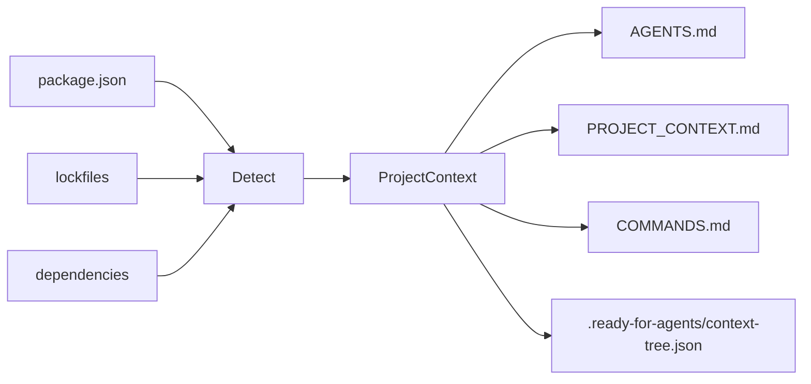
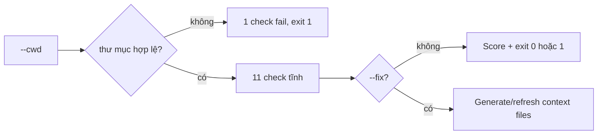

<pre align="center">
██████╗ ███████╗ █████╗ ██████╗ ██╗   ██╗    ███████╗ ██████╗ ██████╗
██╔══██╗██╔════╝██╔══██╗██╔══██╗╚██╗ ██╔╝    ██╔════╝██╔═══██╗██╔══██╗
██████╔╝█████╗  ███████║██║  ██║ ╚████╔╝     █████╗  ██║   ██║██████╔╝
██╔══██╗██╔══╝  ██╔══██║██║  ██║  ╚██╔╝      ██╔══╝  ██║   ██║██╔══██╗
██║  ██║███████╗██║  ██║██████╔╝   ██║       ██║     ╚██████╔╝██║  ██║
╚═╝  ╚═╝╚══════╝╚═╝  ╚═╝╚═════╝    ╚═╝       ╚═╝      ╚═════╝ ╚═╝  ╚═╝

 █████╗  ██████╗ ███████╗███╗   ██╗████████╗███████╗
██╔══██╗██╔════╝ ██╔════╝████╗  ██║╚══██╔══╝██╔════╝
███████║██║  ███╗█████╗  ██╔██╗ ██║   ██║   ███████╗
██╔══██║██║   ██║██╔══╝  ██║╚██╗██║   ██║   ╚════██║
██║  ██║╚██████╔╝███████╗██║ ╚████║   ██║   ███████║
╚═╝  ╚═╝ ╚═════╝ ╚══════╝╚═╝  ╚═══╝   ╚═╝   ╚══════╝
</pre>

<p align="center">
  <a href="https://www.npmjs.com/package/ready-for-agents"></a>
  <a href="https://www.npmjs.com/package/ready-for-agents"></a>
  <a href="https://www.npmjs.com/package/ready-for-agents"></a>
  <a href="https://github.com/LeMinhSang2k5/ready-for-agents/blob/main/LICENSE"></a>
  <a href="https://github.com/LeMinhSang2k5/ready-for-agents"></a>
  <br>
  <a href="https://github.com/LeMinhSang2k5/ready-for-agents/tree/main/doc/guide"></a>
  <a href="https://github.com/LeMinhSang2k5/ready-for-agents"></a>
  <a href="https://github.com/LeMinhSang2k5"></a>
  <a href="./README.md"></a>
</p>

---

> **Biến mọi repository thành workspace sẵn sàng cho AI agent trong 30 giây.**

CLI nhỏ quét project Node.js và sinh các file context cho **Cursor**, **Codex**, **Claude Code**, **Copilot** và các AI coding agent khác — để agent không còn đoán stack, script hay cấu trúc thư mục của bạn.

---

## Bắt đầu nhanh

```bash
npx ready-for-agents init
```

Xem trước (nên dùng trước khi ghi file):

```bash
npx ready-for-agents init --dry-run
```

Sinh file native cho Cursor và Claude Code:

```bash
npx ready-for-agents init --cursor
npx ready-for-agents init --claude
npx ready-for-agents init --all
```

Cập nhật lại các file context sau khi project thay đổi:

```bash
npx ready-for-agents update
npx ready-for-agents update --check
npx ready-for-agents update --check --json
npx ready-for-agents update --all
```

Kiểm tra project đã sẵn sàng cho AI agent chưa (không ghi file):

```bash
npx ready-for-agents doctor
npx ready-for-agents doctor --fix --dry-run
npx ready-for-agents doctor --fix
npx ready-for-agents doctor --cwd /path/to/your-project
```

Biến instruction thô thành prompt gọn, sẵn sàng cho agent (không gọi AI API):

```bash
npx ready-for-agents prompt "kiểm tra doctor --json giúp tôi"
npx ready-for-agents prompt "kiểm tra doctor --json giúp tôi" --context --compact
npx ready-for-agents prompt --target en "sửa lỗi doctor --json giúp tôi"
echo "review api. chạy pnpm test" | npx ready-for-agents prompt --stdin --json
```

Sau khi install global, form ngắn dùng hằng ngày là:

```bash
rfa p "kiểm tra doctor --json hoạt động đúng chưa"
```

Tạo config cục bộ để bớt phải gõ flag lặp lại:

```bash
npx ready-for-agents config init
```

Sinh context tree cache gọn cho các file agent đã generated:

```bash
npx ready-for-agents index
npx ready-for-agents index --json
```

Hỏi context tree agent nên đọc section nào trước:

```bash
npx ready-for-agents query "how should I verify this change?"
npx ready-for-agents query "kiểm tra doctor hoạt động đúng chưa" --json
```

### Bảng lệnh nhanh


| Lệnh          | Dùng khi bạn muốn...                           | Có ghi file không?                            |
| ------------- | ---------------------------------------------- | --------------------------------------------- |
| `init`        | tạo context files cho project                  | Có, trừ khi dùng `--dry-run`                  |
| `update`      | refresh context đã sinh sau khi repo thay đổi  | Có, trừ `--dry-run`, `--check`, hoặc `--json` |
| `doctor`      | kiểm tra project đã sẵn sàng cho AI agent chưa | Chỉ khi dùng `--fix`                          |
| `prompt`      | biến instruction thô thành prompt có cấu trúc  | Không                                         |
| `config init` | tạo `.ready-for-agents.json`                   | Có, trừ khi dùng `--dry-run`                  |
| `index`       | tạo `.ready-for-agents/context-tree.json`      | Có, trừ `--dry-run` hoặc `--json`             |
| `query`       | chọn section context phù hợp cho một task      | Không                                         |


---

## Vì sao cần tool này?

AI agent hoạt động tốt hơn khi đã biết sẵn:


| Không có context                     | Với `ready-for-agents`                   |
| ------------------------------------ | ---------------------------------------- |
| Đoán `npm` hay `pnpm`                | Đọc lockfile + `package.json`            |
| Bịa lệnh build/test                  | Dùng script thật trong `package.json`    |
| Sửa nhầm lockfile                    | `AGENTS.md` ghi rõ file không nên đụng   |
| Mỗi session phải giải thích lại repo | `PROJECT_CONTEXT.md` nằm ngay trong repo |
| Agent đọc hết context mỗi lượt       | `query` chọn section liên quan trước     |


---

## Bạn nhận được gì?

Sau `init`, thư mục gốc project có thể có:


| File                                  | Mục đích                                                      |
| ------------------------------------- | ------------------------------------------------------------- |
| `AGENTS.md`                           | Cách agent làm việc trong repo (quy tắc, folder, test)        |
| `PROJECT_CONTEXT.md`                  | Stack, package manager, dependencies, ghi chú                 |
| `COMMANDS.md`                         | Lệnh dev, build, test, lint và script liên quan               |
| `.cursor/rules/ready-for-agents.mdc`  | Cursor project rule tùy chọn (`init --cursor` hoặc `--all`)   |
| `CLAUDE.md`                           | Hướng dẫn Claude Code tùy chọn (`init --claude` hoặc `--all`) |
| `.ready-for-agents/context-tree.json` | Context tree cache gọn cho các file generated                 |
| `.ready-for-agents.json`              | Config project tùy chọn (`config init`)                       |


```text
my-app/
├── package.json
├── AGENTS.md              ← sinh tự động
├── PROJECT_CONTEXT.md     ← sinh tự động
├── COMMANDS.md            ← sinh tự động
└── .ready-for-agents/
    └── context-tree.json  ← cache sinh tự động
```

---

## Cài đặt

**Chạy một lần (không cần cài global):**

```bash
npx ready-for-agents init
```

**pnpm:**

```bash
pnpm dlx ready-for-agents init
```

**Cài global:**

```bash
npm install -g ready-for-agents
ready-for-agents init
```

Yêu cầu **Node.js 18+**.

---

## Cách dùng

### Sinh context (thư mục hiện tại)

```bash
ready-for-agents init
```

### Quét project khác

Dùng **đường dẫn tuyệt đối** (không gõ `cd` vào `--cwd`):

```bash
ready-for-agents init --cwd /Users/you/projects/my-app
```

### Chỉ xem trước, không ghi file

```bash
ready-for-agents init --dry-run
```

### Ghi đè file đã sinh trước đó

```bash
ready-for-agents init --force
```

### Sinh file native cho agent

```bash
ready-for-agents init --cursor
ready-for-agents init --claude
ready-for-agents init --all
ready-for-agents init --index
```

Mặc định `init`, `update`, và `doctor --fix` cũng sinh `.ready-for-agents/context-tree.json`. Bạn có thể tắt trong `.ready-for-agents.json` bằng `"files": { "index": false }`, rồi bật riêng từng lệnh bằng `--index`.

### Cập nhật file context đã sinh

`update` regenerate các file context được chọn. Lệnh này refresh file đã được `ready-for-agents` sinh trước đó, tạo file còn thiếu, và bỏ qua file user tự viết trừ khi bạn truyền `--force`.

```bash
ready-for-agents update
ready-for-agents update --dry-run
ready-for-agents update --check
ready-for-agents update --check --json
ready-for-agents update --all
ready-for-agents update --index
ready-for-agents update --force
ready-for-agents update --cwd /Users/you/projects/my-app
```

### Kết hợp flag

```bash
ready-for-agents init --cwd ./my-app --dry-run
ready-for-agents init --cwd ./my-app --force
```

### Tùy chọn CLI


| Flag           | Mô tả                                                                  |
| -------------- | ---------------------------------------------------------------------- |
| `--dry-run`    | In thông tin detect + preview đầy đủ; **không ghi** ra disk            |
| `--force`      | Ghi đè `AGENTS.md`, `PROJECT_CONTEXT.md`, `COMMANDS.md` nếu đã tồn tại |
| `--cursor`     | Sinh thêm `.cursor/rules/ready-for-agents.mdc`                         |
| `--claude`     | Sinh thêm `CLAUDE.md`                                                  |
| `--all`        | Sinh toàn bộ file agent tùy chọn                                       |
| `--index`      | Sinh `.ready-for-agents/context-tree.json`                             |
| `--cwd <path>` | Thư mục project cần quét (mặc định: thư mục làm việc hiện tại)         |


### Tùy chọn update


| Flag           | Mô tả                                                              |
| -------------- | ------------------------------------------------------------------ |
| `--dry-run`    | Preview nội dung refresh, không ghi file                           |
| `--check`      | Kiểm tra file generated đã cập nhật chưa; không ghi file           |
| `--json`       | In kết quả check dạng machine-readable; không ghi file             |
| `--force`      | Ghi đè file hiện có nhưng không có marker generated                |
| `--cursor`     | Refresh thêm `.cursor/rules/ready-for-agents.mdc`                  |
| `--claude`     | Refresh thêm `CLAUDE.md`                                           |
| `--all`        | Refresh toàn bộ file agent tùy chọn                                |
| `--index`      | Regenerate `.ready-for-agents/context-tree.json`                   |
| `--cwd <path>` | Thư mục project cần cập nhật (mặc định: thư mục làm việc hiện tại) |


File generated có một HTML comment marker nhỏ kèm hash nội dung. `update` dùng marker này để phân biệt file do tool sinh với file bạn tự viết tay, và skip file có hash marker không còn khớp body.

### Kiểm tra hoặc sửa readiness (`doctor`)

Mặc định chỉ chạy check tĩnh. Khi có `--fix`, lệnh sẽ tạo file context còn thiếu, refresh file generated đã cũ, và bỏ qua file user tự viết trừ khi bạn truyền `--force`.

```bash
ready-for-agents doctor
ready-for-agents doctor --fix --dry-run
ready-for-agents doctor --fix
ready-for-agents doctor --fix --json
ready-for-agents doctor --fix --index
ready-for-agents doctor --cwd /Users/you/projects/my-app
ready-for-agents doctor --json
```


| Flag           | Mô tả                                                              |
| -------------- | ------------------------------------------------------------------ |
| `--cwd <path>` | Thư mục project cần kiểm tra (mặc định: thư mục làm việc hiện tại) |
| `--json`       | In JSON machine-readable cho CI; không in text màu                 |
| `--fix`        | Tạo file thiếu và refresh file generated đã cũ                     |
| `--dry-run`    | Với `--fix`, preview thay đổi mà không ghi file                    |
| `--force`      | Với `--fix`, ghi đè file existing không có marker generated        |
| `--cursor`     | Với `--fix`, include `.cursor/rules/ready-for-agents.mdc`          |
| `--claude`     | Với `--fix`, include `CLAUDE.md`                                   |
| `--all`        | Với `--fix`, include toàn bộ file agent tùy chọn                   |
| `--index`      | Với `--fix`, sinh `.ready-for-agents/context-tree.json`            |


**Exit code:** `0` khi không có check `fail`; `1` khi có ít nhất một `fail` (ví dụ thiếu `package.json`).

Nếu `--cwd` không tồn tại hoặc không phải thư mục, `doctor` **dừng sau check đầu tiên** — báo đúng gốc lỗi, không liệt kê hàng loạt warn “thiếu context file” gây hiểu nhầm.

`doctor --fix` không sửa lỗi project critical như thiếu hoặc hỏng `package.json`; bạn cần xử lý các lỗi đó trước.

### Cấu trúc instruction (`prompt`)

Biến instruction thô thành prompt gọn, có cấu trúc — **chỉ xử lý tĩnh**, MVP chưa dùng model dịch.

```bash
ready-for-agents prompt "kiểm tra doctor --json giúp tôi"
ready-for-agents prompt --target en "sửa lỗi doctor --json giúp tôi"
ready-for-agents prompt --target vi "Explain what prompt does"
ready-for-agents prompt "kiểm tra doctor --json" --context --compact
ready-for-agents p "kiểm tra doctor --json"
ready-for-agents prompt --stdin
ready-for-agents prompt --file task.txt
ready-for-agents prompt --cwd /Users/you/projects/my-app "Explain this task"
ready-for-agents prompt
```


| Flag                    | Mô tả                                                |
| ----------------------- | ---------------------------------------------------- |
| `[text]`                | Instruction (tham số vị trí)                         |
| `--stdin`               | Đọc instruction từ stdin                             |
| `--file <path>`         | Đọc instruction từ file                              |
| `--target <auto|en|vi>` | Chọn instruction ngôn ngữ cho phần response          |
| `--context`             | Chèn section context liên quan từ context-tree       |
| `--no-context`          | Tắt context lookup                                   |
| `--compact`             | Render prompt ngắn hơn                               |
| `--no-compact`          | Render prompt dạng standard                          |
| `--context-limit <n>`   | Số section context tối đa                            |
| `--json`                | In JSON thay vì Markdown                             |
| `--stats`               | In thống kê độ dài ra stderr                         |
| `--cwd <path>`          | Thư mục project dùng để đọc `.ready-for-agents.json` |


**Exit code:** `0` khi thành công; `1` khi input rỗng sau normalize.

`--target` vẫn là rule-based. Flag này điều khiển instruction ngôn ngữ trong prompt output; không gọi model dịch.

Nếu bỏ `--target`, `prompt` đọc `prompt.target` trong `.ready-for-agents.json`, sau đó fallback về `auto`.

`p` là alias ngắn của `prompt` với default `--context --compact`. Dùng `--no-context` hoặc `--no-compact` nếu muốn tắt.

Spec: `[doc/guide/PROMPT_SPEC.md](./doc/guide/PROMPT_SPEC.md)`.

### Cấu hình mặc định

Dùng config khi bạn thường xuyên muốn cùng optional files, prompt target, hoặc output path cho context tree:

```bash
ready-for-agents config init
ready-for-agents config init --dry-run
ready-for-agents config init --force
```

Config mặc định:

```json
{
  "$schema": "https://ready-for-agents.dev/config.schema.json",
  "files": {
    "cursor": false,
    "claude": false,
    "all": false,
    "index": true
  },
  "doctor": {
    "fix": {
      "all": false,
      "force": false,
      "index": true
    }
  },
  "prompt": {
    "target": "auto",
    "context": false,
    "style": "standard",
    "contextLimit": 5
  },
  "index": {
    "output": ".ready-for-agents/context-tree.json"
  }
}
```

Tên config hiện tại là `.ready-for-agents.json`. Tên cũ `.agent-context-kit.json` vẫn được đọc để tương thích ngược.

### Sinh context tree (`index`)

`index` đọc các file generated và ghi tree gọn gồm heading, anchor, hash, keyword, command, summary và token estimate. Agent hoặc CI có thể đọc cache này trước, thay vì quét lại toàn bộ Markdown mỗi lần.

```bash
ready-for-agents index
ready-for-agents index --dry-run
ready-for-agents index --json
ready-for-agents index --output .cache/agent-context-tree.json
ready-for-agents index --cwd /Users/you/projects/my-app
```

Output mặc định là `.ready-for-agents/context-tree.json` và có thể đổi trong config.

### Query context liên quan (`query`)

`query` dùng `.ready-for-agents/context-tree.json` khi có, hoặc scan live các file context generated hiện có. Output gồm section reference, line range, summary ngắn, lý do match và token estimate để agent đọc đúng phần liên quan trước.

```bash
ready-for-agents query "how should I verify this change?"
ready-for-agents query "kiểm tra doctor hoạt động đúng chưa" --limit 4
ready-for-agents query "show stack and dependencies" --json
ready-for-agents query "fix build" --cwd /Users/you/projects/my-app
```

Flow nên dùng:

```bash
ready-for-agents init --index
ready-for-agents query "mô tả task của bạn"
```

Dùng JSON output cho CI:

```bash
ready-for-agents doctor --json
```

```json
{
  "cwd": "/path/to/project",
  "ok": true,
  "score": {
    "passed": 11,
    "warned": 0,
    "failed": 0,
    "total": 11
  },
  "checks": [
    {
      "label": "Project directory found",
      "status": "pass"
    }
  ]
}
```

**Các check (khi thư mục hợp lệ):**


| Check                                            | `pass`                               | `warn`           | `fail`                               |
| ------------------------------------------------ | ------------------------------------ | ---------------- | ------------------------------------ |
| Thư mục project                                  | tồn tại và là directory              | —                | không tồn tại / không phải directory |
| `package.json`                                   | có                                   | —                | thiếu                                |
| JSON `package.json`                              | hợp lệ                               | —                | sai / không đọc được                 |
| Package manager                                  | lockfile hoặc field `packageManager` | chỉ fallback npm | —                                    |
| `AGENTS.md`, `PROJECT_CONTEXT.md`, `COMMANDS.md` | có                                   | thiếu            | —                                    |
| script `dev`, `build`, `test`                    | có                                   | thiếu            | —                                    |
| `README.md`                                      | có                                   | thiếu            | —                                    |


---

## Ví dụ output terminal

```text
ready-for-agents

Detected:
- Project: todoist-style-demo
- Package manager: npm
- Framework: React/Vite + Express
- Database: MongoDB/Mongoose
- Scripts: dev, dev:client, dev:server, build

Would generate:
- AGENTS.md
- PROJECT_CONTEXT.md
- COMMANDS.md
- .ready-for-agents/context-tree.json

──────────────────────────────────────────────
Dry run — no files written.
```

Khi ghi file thật:

```text
Generated:
- PROJECT_CONTEXT.md
- COMMANDS.md
Skipped:
- AGENTS.md already exists. Use --force to overwrite.
```

Với `--force`:

```text
Overwritten:
- AGENTS.md
Generated:
- PROJECT_CONTEXT.md
- COMMANDS.md
```

`doctor` (`--cwd` sai — dừng sớm):

```text
ready-for-agents doctor

Checks:
  ✗ Project directory found (/wrong/path does not exist)

Score: 0/1 · 0 warnings · 1 failure
```

`doctor` (project hợp lệ, thiếu vài file context):

```text
ready-for-agents doctor

Checks:
  ✓ Project directory found
  ✓ package.json found
  ✓ package.json is valid JSON
  ✓ Package manager detected: npm
  ! AGENTS.md found
  ! PROJECT_CONTEXT.md found
  ! COMMANDS.md found
  ✓ dev script found
  ✓ build script found
  ! test script not found
  ✓ README.md found

Score: 6/11 · 4 warnings · 0 failures
```

---

## Tool detect được gì (MVP)

Phân tích **tĩnh** (từ `package.json`, lockfile, folder gốc) — **không** gọi AI API.

### Package manager

Thứ tự ưu tiên: **lockfile** → field `packageManager` trong `package.json` → mặc định **npm**


| Tín hiệu                         | Kết quả                      |
| -------------------------------- | ---------------------------- |
| `pnpm-lock.yaml`                 | pnpm                         |
| `yarn.lock`                      | yarn                         |
| `bun.lock` / `bun.lockb`         | bun                          |
| `package-lock.json`              | npm                          |
| `"packageManager": "pnpm@9.0.0"` | pnpm (khi không có lockfile) |


### Stack (có thể kết hợp nhiều lớp)

Mỗi lớp chọn **rule khớp đầu tiên** từ `dependencies` + `devDependencies`. Nhiều lớp có thể cùng xuất hiện (frontend + backend + database).


| Lớp      | Nhãn detect (theo thứ tự rule)                                               |
| -------- | ---------------------------------------------------------------------------- |
| Frontend | Next.js, Nuxt, React/Vite, Vue/Vite, React (CRA), React, Vue, Svelte         |
| Backend  | NestJS, Express, Fastify, Koa, Hono                                          |
| Database | MongoDB/Mongoose, MongoDB, Prisma, TypeORM, PostgreSQL, MySQL, SQLite, Redis |


Không khớp rule nào → framework summary mặc định **Node.js**.

Ví dụ full-stack: **React/Vite + Express** với **MongoDB/Mongoose**.

### Scripts

Map các key logic (alias đầu tiên có trong `package.json` được dùng):


| Key         | Alias cũng được kiểm tra                 |
| ----------- | ---------------------------------------- |
| `dev`       | `start:dev`, `develop`                   |
| `build`     | `build`                                  |
| `test`      | `test`, `test:unit`, `test:run`          |
| `lint`      | `lint`, `eslint`                         |
| `typecheck` | `typecheck`, `type-check`, `check:types` |
| `format`    | `format`, `prettier`, `fmt`              |


Cũng liệt kê script liên quan (`dev:client`, `dev:server`, …) nếu có prefix `dev:*` hoặc được gọi trong lệnh `dev`.

### Folder quan trọng

Kiểm tra ở root: `src/`, `app/`, `pages/`, `components/`, `lib/`, `tests/`.

---

## Mặc định an toàn

- **Không ghi đè** `AGENTS.md`, `PROJECT_CONTEXT.md`, `COMMANDS.md` trừ khi có `--force`
- `**--dry-run`** không đụng filesystem
- Bỏ qua thư mục nặng (`node_modules`, `.git`, `dist`, …) khi quét
- Bỏ qua thư mục cache generated (`.ready-for-agents/`) khi quét
- Báo lỗi rõ khi thiếu/sai `package.json` hoặc `--cwd` không hợp lệ (`init`, `update`, `doctor`)
- `doctor` dừng sớm khi `--cwd` sai (tránh warn “thiếu file context” gây nhiễu)

---

## Cách hoạt động

`**init**` — detect → sinh Markdown:




`**doctor**` — validate; `--fix` có thể sửa context files an toàn:




**Đặc tả đầy đủ:** `[doc/guide/README.md](./doc/guide/README.md)` (yêu cầu, CLI, mô hình dữ liệu, rule detect, kiến trúc).  
Chi tiết mã nguồn: `[doc/guide/SRC_WORKFLOW.md](./doc/guide/SRC_WORKFLOW.md)`.

---

## Phát triển

Clone và làm việc trên CLI:

```bash
pnpm install
pnpm dev init --dry-run
pnpm dev init --cwd /path/to/your-project --dry-run
pnpm dev doctor --cwd /path/to/your-project
pnpm dev doctor --fix --dry-run --cwd /path/to/your-project
pnpm dev config init --dry-run --cwd /path/to/your-project
pnpm dev index --dry-run --cwd /path/to/your-project
pnpm dev query "kiểm tra thay đổi này thế nào?" --cwd /path/to/your-project
pnpm test
pnpm typecheck
pnpm build
pnpm start init --help
pnpm start doctor --cwd /path/to/your-project
pnpm start index --cwd /path/to/your-project
pnpm start query "show stack and dependencies" --cwd /path/to/your-project
pnpm --silent start doctor --json --cwd /path/to/your-project
```

Phát hành: [CHANGELOG.md](./CHANGELOG.md) · Publish: [PUBLISH_CHECKLIST.md](./PUBLISH_CHECKLIST.md)

---

## Roadmap

- `ready-for-agents doctor` — kiểm tra project sẵn sàng cho agent (check tĩnh, không ghi file)
- `doctor --fix` — tạo/refresh context files an toàn
- `doctor --json` — output JSON cho CI
- `ready-for-agents prompt` — cấu trúc instruction thô, hỗ trợ `--file` và interactive mode (không AI API)
- `prompt --target auto|en|vi` — chọn instruction ngôn ngữ cho response
- Sinh `.cursor/rules` và `CLAUDE.md` tùy chọn
- `ready-for-agents update` — refresh context sau khi repo thay đổi
- `.ready-for-agents.json` — default cho optional files, prompt target, index output
- `ready-for-agents index` — context tree cache gọn cho file agent generated
- `ready-for-agents query` — chọn section context liên quan trước khi đọc full file
- `prompt --style` (v0.2)
- `prompt --ai` rewrite tùy chọn (v0.3)
- Hỗ trợ Python / FastAPI / Django
- GitHub Action đồng bộ context
- Tùy chọn tóm tắt bằng AI

---

## Giấy phép

[MIT](./LICENSE)