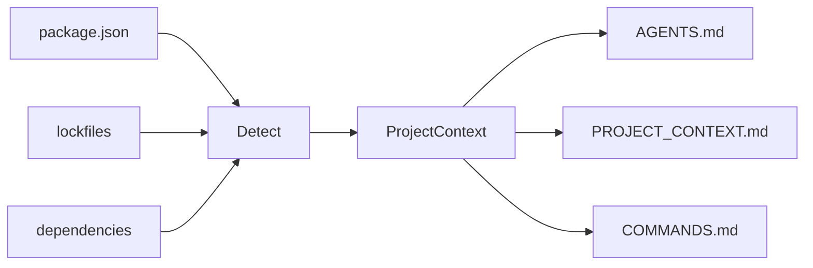

# agent-context-kit

<p align="right">
  <a href="./README.md">English</a> · <strong>Tiếng Việt</strong>
</p>

> **Biến mọi repository thành workspace sẵn sàng cho AI agent trong 30 giây.**

CLI nhỏ quét project Node.js và sinh các file context cho **Cursor**, **Codex**, **Claude Code**, **Copilot** và các AI coding agent khác — để agent không còn đoán stack, script hay cấu trúc thư mục của bạn.

---

## Bắt đầu nhanh

```bash
npx agent-context-kit init
```

Xem trước (nên dùng trước khi ghi file):

```bash
npx agent-context-kit init --dry-run
```

---

## Vì sao cần tool này?

AI agent hoạt động tốt hơn khi đã biết sẵn:

| Không có context | Với `agent-context-kit` |
|------------------|-------------------------|
| Đoán `npm` hay `pnpm` | Đọc lockfile + `package.json` |
| Bịa lệnh build/test | Dùng script thật trong `package.json` |
| Sửa nhầm lockfile | `AGENTS.md` ghi rõ file không nên đụng |
| Mỗi session phải giải thích lại repo | `PROJECT_CONTEXT.md` nằm ngay trong repo |

---

## Bạn nhận được gì?

Sau `init`, thư mục gốc project có thể có:

| File | Mục đích |
|------|----------|
| `AGENTS.md` | Cách agent làm việc trong repo (quy tắc, folder, test) |
| `PROJECT_CONTEXT.md` | Stack, package manager, dependencies, ghi chú |
| `COMMANDS.md` | Lệnh dev, build, test, lint và script liên quan |

```text
my-app/
├── package.json
├── AGENTS.md              ← sinh tự động
├── PROJECT_CONTEXT.md     ← sinh tự động
└── COMMANDS.md            ← sinh tự động
```

---

## Cài đặt

**Chạy một lần (không cần cài global):**

```bash
npx agent-context-kit init
```

**pnpm:**

```bash
pnpm dlx agent-context-kit init
```

**Cài global:**

```bash
npm install -g agent-context-kit
agent-context-kit init
```

Yêu cầu **Node.js 18+**.

---

## Cách dùng

### Sinh context (thư mục hiện tại)

```bash
agent-context-kit init
```

### Quét project khác

Dùng **đường dẫn tuyệt đối** (không gõ `cd` vào `--cwd`):

```bash
agent-context-kit init --cwd /Users/you/projects/my-app
```

### Chỉ xem trước, không ghi file

```bash
agent-context-kit init --dry-run
```

### Ghi đè file đã sinh trước đó

```bash
agent-context-kit init --force
```

### Kết hợp flag

```bash
agent-context-kit init --cwd ./my-app --dry-run
agent-context-kit init --cwd ./my-app --force
```

### Tùy chọn CLI

| Flag | Mô tả |
|------|--------|
| `--dry-run` | In thông tin detect + preview đầy đủ; **không ghi** ra disk |
| `--force` | Ghi đè `AGENTS.md`, `PROJECT_CONTEXT.md`, `COMMANDS.md` nếu đã tồn tại |
| `--cwd <path>` | Thư mục project cần quét (mặc định: thư mục làm việc hiện tại) |

---

## Ví dụ output terminal

```text
agent-context-kit

Detected:
- Project: todoist-style-demo
- Package manager: npm
- Framework: React/Vite + Express
- Database: MongoDB/Mongoose
- Scripts: dev, dev:client, dev:server, build

Would generate:
- AGENTS.md
- PROJECT_CONTEXT.md
- COMMANDS.md

──────────────────────────────────────────────
Dry run — no files written.
```

Khi ghi file thật:

```text
Generated:
- PROJECT_CONTEXT.md
- COMMANDS.md
Skipped:
- AGENTS.md already exists. Use --force to overwrite.
```

Với `--force`:

```text
Overwritten:
- AGENTS.md
Generated:
- PROJECT_CONTEXT.md
- COMMANDS.md
```

---

## Tool detect được gì (MVP)

Phân tích **tĩnh** (từ `package.json`, lockfile, folder gốc) — **không** gọi AI API.

### Package manager

Thứ tự ưu tiên: **lockfile** → field `packageManager` trong `package.json` → mặc định **npm**

| Tín hiệu | Kết quả |
|----------|---------|
| `pnpm-lock.yaml` | pnpm |
| `yarn.lock` | yarn |
| `bun.lock` / `bun.lockb` | bun |
| `package-lock.json` | npm |
| `"packageManager": "pnpm@9.0.0"` | pnpm (khi không có lockfile) |

### Stack (có thể kết hợp nhiều lớp)

| Lớp | Ví dụ |
|-----|--------|
| Frontend | Next.js, React/Vite, Vue/Vite, React |
| Backend | Express, NestJS, Fastify |
| Database | MongoDB/Mongoose, PostgreSQL, Prisma, Redis |

Ví dụ full-stack: **React/Vite + Express** với **MongoDB/Mongoose**.

### Scripts

Map các script phổ biến: `dev`, `build`, `test`, `lint`, `typecheck`, `format`.

Cũng liệt kê script liên quan như `dev:client`, `dev:server` khi được tham chiếu trong script `dev`.

### Folder quan trọng

Kiểm tra ở root: `src/`, `app/`, `pages/`, `components/`, `lib/`, `tests/`.

---

## Mặc định an toàn

- **Không ghi đè** `AGENTS.md`, `PROJECT_CONTEXT.md`, `COMMANDS.md` trừ khi có `--force`
- **`--dry-run`** không đụng filesystem
- Bỏ qua thư mục nặng (`node_modules`, `.git`, `dist`, …) khi quét
- Báo lỗi rõ khi thiếu/sai `package.json` hoặc `--cwd` không hợp lệ

---

## Cách hoạt động



Chi tiết mã nguồn: [`doc/guide/SRC_WORKFLOW.md`](./doc/guide/SRC_WORKFLOW.md)

---

## Phát triển

Clone và làm việc trên CLI:

```bash
pnpm install
pnpm dev init --dry-run
pnpm dev init --cwd /path/to/your-project --dry-run
pnpm test
pnpm typecheck
pnpm build
pnpm start init --help
```

---

## Roadmap

- [ ] `agent-context-kit update` — cập nhật context khi repo đổi
- [ ] `agent-context-kit doctor` — kiểm tra context vs project hiện tại
- [ ] Sinh `.cursor/rules` và `CLAUDE.md`
- [ ] Hỗ trợ Python / FastAPI / Django
- [ ] GitHub Action đồng bộ context
- [ ] Tùy chọn tóm tắt bằng AI

---

## Giấy phép

[MIT](./LICENSE)
