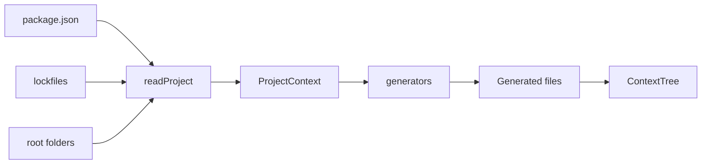

# Data Model

The code source of truth is `src/types.ts` plus command-specific types.

---

## 1. Data Flow



---

## 2. `ProjectContext`

```ts
type ProjectContext = {
  cwd: string;
  name: string;
  packageManager: PackageManager;
  packageManagerSource: PackageManagerSource;
  stack: ProjectStack;
  scripts: Record<string, string>;
  folders: string[];
  dependencies: Record<string, string>;
  devDependencies: Record<string, string>;
};
```

`ProjectContext` is created by `readProject(cwd)` and consumed by most generators.

---

## 3. Stack Model

```ts
type StackLayer = {
  label: string;
  source: string[];
};

type ProjectStack = {
  frontend?: StackLayer;
  backend?: StackLayer;
  database?: StackLayer;
};
```

Each layer is selected by ordered static rules over `dependencies + devDependencies`.

---

## 4. Script Model

```ts
type ScriptKey = "dev" | "build" | "test" | "lint" | "typecheck" | "format";
```

`pickCommonScripts(scripts)` maps package script aliases into these logical keys. The raw `ctx.scripts` object remains available for display and related script detection.

---

## 5. Generated Output Model

```ts
const OUTPUT_FILES = [
  "AGENTS.md",
  "PROJECT_CONTEXT.md",
  "COMMANDS.md",
  "RUNBOOK.md",
  ".cursor/rules/ready-for-agents.mdc",
  "CLAUDE.md",
  ".github/copilot-instructions.md",
  ".github/workflows/ready-for-agents.yml",
] as const;

type OutputFile = (typeof OUTPUT_FILES)[number];
type GeneratedFileMap = Partial<Record<OutputFile, string>>;
```

Core `init` output includes `AGENTS.md`, `PROJECT_CONTEXT.md`, and `COMMANDS.md`. Other files are command-specific or optional.

### Generated Marker

Generated Markdown and YAML files include a content hash marker:

```ts
type GeneratedMarker = {
  file: OutputFile;
  hash: string;
};
```

`hasGeneratedMarker(content, file)` is true only when the file path matches and the stored hash matches the current body after stripping the marker.

---

## 6. Update Check Model

```ts
type UpdateCheckJsonOutput = {
  cwd: string;
  ok: boolean;
  upToDate: OutputFile[];
  outdated: OutputFile[];
  missing: OutputFile[];
  untracked: OutputFile[];
};
```

| Field | Meaning |
| --- | --- |
| `upToDate` | File exists and equals current generated output |
| `outdated` | File has a valid generated marker but content is stale |
| `missing` | Selected output file does not exist |
| `untracked` | File exists but is not recognized as safe to overwrite |

---

## 7. Environment Scan Model

```ts
type EnvVariableInfo = {
  name: string;
  sources: string[];
  sensitive: boolean;
};

type EnvironmentScanResult = {
  variables: EnvVariableInfo[];
  safeTemplateFiles: string[];
  sensitiveEnvFiles: string[];
  scannedSourceFiles: number;
  truncated: boolean;
};
```

The scan result stores variable names and sources, never values.

---

## 8. Configuration Model

Primary config file: `.ready-for-agents.json`.  
Legacy config fallback: `.agent-context-kit.json`.

```ts
type ReadyForAgentsConfig = {
  files?: {
    cursor?: boolean;
    claude?: boolean;
    copilot?: boolean;
    all?: boolean;
    index?: boolean;
  };
  doctor?: {
    fix?: {
      cursor?: boolean;
      claude?: boolean;
      copilot?: boolean;
      all?: boolean;
      force?: boolean;
      index?: boolean;
    };
  };
  prompt?: {
    target?: "auto" | "en" | "vi";
    context?: boolean;
    style?: "standard" | "compact";
    contextLimit?: number;
  };
  index?: {
    output?: string;
  };
};
```

CLI flags override config defaults.

---

## 9. Context Tree Model

```ts
type ContextTree = {
  version: 1;
  tool: "ready-for-agents";
  project: {
    name: string;
    cwd: string;
    packageManager: string;
  };
  summary: {
    filesIndexed: number;
    filesMissing: number;
    sectionsIndexed: number;
    tokensEstimate: number;
  };
  files: ContextTreeFile[];
};

type ContextTreeFile = {
  path: OutputFile;
  kind: "core" | "runbook" | "cursor" | "claude" | "copilot" | "ci";
  exists: boolean;
  hash?: string;
  bytes?: number;
  tokensEstimate: number;
  sections: ContextTreeSection[];
};
```

The context tree is a cache. It has no generated marker because it is JSON and can be regenerated at any time.

---

## 10. Prompt Model

```ts
type PromptIntent =
  | "explain"
  | "review"
  | "fix"
  | "verify"
  | "clarify"
  | "general";

type PromptBrief = {
  source: PromptSource;
  target: "auto" | "en" | "vi";
  original: string;
  intent: PromptIntent;
  task: string;
  context: string[];
  requirements: string[];
  constraints: string[];
  verify: string[];
  unclear: string[];
  response: string[];
  stats: PromptStats;
};
```
